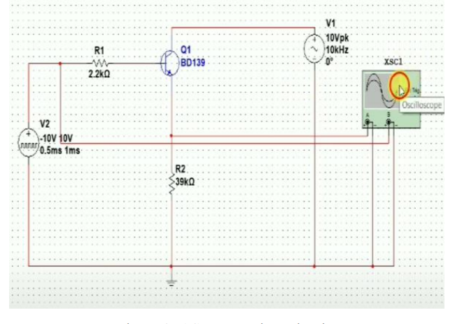

# FSM in ASIC with RF Transmitter using esim
  * [Abstract](#abstract)
  * [Reference Circuit Details](#reference-circuit-details)
  * [Reference Circuit Diagram](#reference-circuit-diagram)
  * [Reference Circuit Waveform](#reference-circuit-waveform)
  * [Desirable Truth Table](#desirable-truth-table)
  * [Tools Used](#tools-used)
- [Simulation in esim](#simulation-in-esim)
  * [FSM_Digital_Block](#fsm-digital-block)
  * [RAM128X32_Block](#ram128x32-digital-block)
  * [3bitDecoder_Block](#3bitdecoder-digital-block)
  * [UART_Block](#uart-digital-block)
  * [PISO_Block](#piso-digital-block)
  * [ASIC_Digital_Block](#asic-digital-block)
  * [Output Waveform](#output-waveform)
  * [DAC_Mixed_Block](#DAC-Mixed-Block)
  * [Comparator_Mixed_Block](#Comparator-Mixed-Block)
  * [UpDownCOUNTER_Mixed_Block](#UpDownCOUNTER-Mixed-Block)
  * [ADC_Mixed_Block](#ADC-Mixed-Block)
  * [Amplitude_Shift_Keying_ASK_Analog_Block](#Amplitude-Shift-Keying-ASK-Analog-Block)
  * [ASK_Waveform](#ASK-Waveform)
  * [Final Schematic](#Final-Schematic)
  * [Netlist](#netlist)
  * [Conclusion](#conclusion)
  * [Author](#author)
  * [Acknowledgement](#acknowlegement)
  * [References](#references)

## Abstract
Finite State Machine (FSM) in ApplicationSpecific Integrated Circuit (ASIC) is highly efficient in terms of computation and power. In this project I want to implementSmart Garden using FSM written in Verilog with wireless interface for remote monitoring. The circuit will be composed ofSystem on a chip, opto-relay, sensors, flash, timer and display. The emphasis of the project is to design a mixed signal circuit. That is the FSM for design a digital circuit written in Verilog and Rf transmitter for the analog circuit.

## Reference Circuit Details

SoC will be composed of FSM, ADC, DAC, I2C, SPI, CAN, RAM, UART and the RF block. I2C, SPI, CAN and ADC will be connected to sensors. DAC will be connected toLED light to control its power. Sensors reading will be recorded every minute and send to remote PC wirelessly via UART every hour. Digital output will be connected to optorelay to control valves for irrigation. The sensors are the temperature sensor, humidity sensor,
rain sensor, light sensor, and moisture sensor. Each of which has its own interface like CAN, SPI, I2C and some are analog. RF block will be connected to antenna. Opto-relay will be connected to digital output of SoC. The LED display will be connected to DAC block..

## Reference Circuit Diagram

## Reference Circuit Waveform

## Desirable State Diagram

## Tools Used:
• esim:
 esim design environment is a modern solution for full-custom analog, custom digital, and mixed-signal IC design. esim provides design entry, simulation management and analysis, and custom layout editing features. This tool was used to design the circuit on a transistor level.
 

# Simulation in esim

## FSM_Digital_Block

## RAM128X32_Digital_Block

## 3bitDecoder_Digital_Block

## UART_Digital_Block

## PISO_Digital_Block

## TIMER_Digital_Block

## ASIC_Digital_Block

## Output Waveform

## DAC_Mixed_Block

## Comparator_Mixed_Block

## UpDownCOUNTER_Mixed_Block

## ADC_Mixed_Block

## Amplitude_Shift_Keying_ASK_Analog_Block

## ASK_Waveform

## Final Schematic

## Netlist

## Author
Glenn Frey Olamit , self.
## Acknowledgement
1. Kunal Ghosh, Co-founder, VSD Corp. Pvt. Ltd. - kunalpghosh@gmail.com
2. Chinmay panda, IIT Hyderabad
3. Sameer Durgoji, NIT Karnataka
4. Steve Hoover, Founder Redwood EDA, LLC - redwoodeda.com
5. [esim Team/Company](https://hackathon.fossee.in/esim/home)
6. https://hackathon.fossee.in/esim/home
## References
Generation of ASK signal using multisim software | Amplitude shift
keying | Acts of Facts..
https://www.youtube.com/watch?v=TrqzPw1Ad5s
 How to write FSM in Verilog?
https://www.asic-world.com/tidbits/verilog_fsm.html
