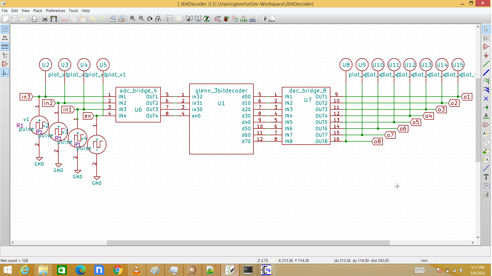
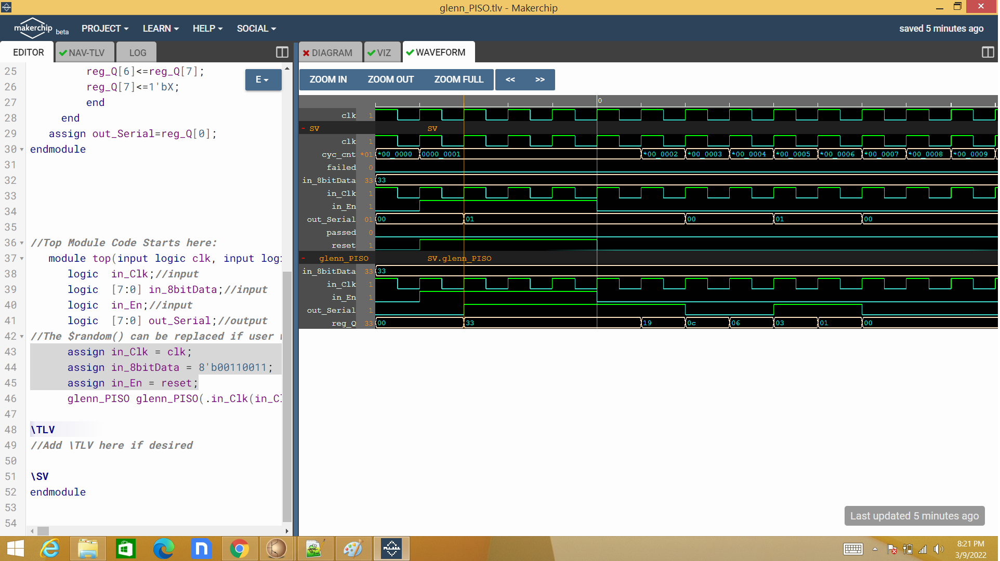
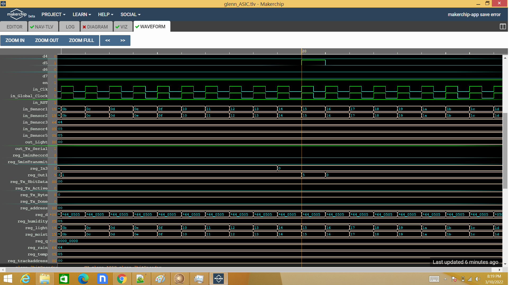

# FSM in ASIC with RF Transmitter using eSim
### MIXED SIGNAL MARATHON

  * [Abstract](#abstract)
  * [Reference Circuit Details](#reference-circuit-details)
  * [Reference Circuit Diagram](#reference-circuit-diagram)
  * [Reference Circuit Waveform](#reference-circuit-waveform)
  * [Desirable Truth Table](#desirable-truth-table)
  * [Tools Used](#tools-used)
- [Simulation in esim](#simulation-in-esim)
  * [FSM_Digital_Block](#fsm-digital-block)
  * [RAM128X32_Digital_Block](#ram128x32-digital-block)
  * [3bitDecoder_Digital_Block](#3bitdecoder-digital-block)
  * [UART_Digital_Block](#uart-digital-block)
  * [PISO_Digital_Block](#piso-digital-block)
  * [ASIC_Digital_Block](#asic-digital-block)
  * [Output Waveform](#output-waveform)
  * [DAC_Mixed_Block](#DAC-Mixed-Block)
  * [Comparator_Mixed_Block](#Comparator-Mixed-Block)
  * [UpDownCOUNTER_Mixed_Block](#UpDownCOUNTER-Mixed-Block)
  * [ADC_Mixed_Block](#ADC-Mixed-Block)
  * [Amplitude_Shift_Keying_ASK_Analog_Block](#Amplitude-Shift-Keying-ASK-Analog-Block)
  * [ASK_Waveform](#ASK-Waveform)
  * [Final Schematic](#Final-Schematic)
  * [Netlist](#netlist)
  * [Conclusion](#conclusion)
  * [Author](#author)
  * [Acknowledgement](#acknowlegement)
  * [References](#references)

## Abstract
Finite State Machine (FSM) in ApplicationSpecific Integrated Circuit (ASIC) is highly efficient in terms of computation and power. In this project I want to implementSmart Garden using FSM written in Verilog with wireless interface for remote monitoring. The circuit will be composed ofSystem on a chip, opto-relay, sensors, flash, timer and display. The emphasis of the project is to design a mixed signal circuit. That is the FSM for design a digital circuit written in Verilog and Rf transmitter for the analog circuit.

## Reference Circuit Details

SoC will be composed of FSM, ADC, DAC, I2C, SPI, CAN, RAM, UART and the RF block. I2C, SPI, CAN and ADC will be connected to sensors. DAC will be connected toLED light to control its power. Sensors reading will be recorded every minute and send to remote PC wirelessly via UART every hour. Digital output will be connected to optorelay to control valves for irrigation. The sensors are the temperature sensor, humidity sensor,
rain sensor, light sensor, and moisture sensor. Each of which has its own interface like CAN, SPI, I2C and some are analog. RF block will be connected to antenna. Opto-relay will be connected to digital output of SoC. The LED display will be connected to DAC block..

## Reference Circuit Diagram

## Reference Circuit Waveform

## Desirable State Diagram

## Tools Used:
• esim:
 esim design environment is a modern solution for full-custom analog, custom digital, and mixed-signal IC design. esim provides design entry, simulation management and analysis, and custom layout editing features. This tool was used to design the circuit on a transistor level.
 

# Simulation in esim

## FSM Digital Block

## RAM128X32 Digital Block

Looking at the waveform the data are not stored as the write enable signal is off state. 

Here the signal are stored as write enable is in logic 1.

Output q outputs the data in the next rotation of address bits.

## 3bitDecoder Digital Block

To create a testbench for all possible input I chose this pattern as shown. It is evident that there is no output when the enable bit is off.

## UART Digital Block

Here looking at the reg_tx_data stores 08 hexadecimal number or 1000 in digital format. Thus the output waveform in out_tx_serial should be 0 for start bit then followed by 0001 because the least significant bit is transmitted first. After 8 bits of data is transmitted a stop bit of 1 is sent then transmission for the stored byte is completed. Also note that the transmission accours at reg_Main_state at state 2 which is the transmission state. for more info you can look at the UART.v files.

Here is 14 which is 10100 in binary form. 

Here is 20 which is 100000 in binary format.

## PISO Digital Block

## TIMER Digital Block

The timer must output after 1 minute as shown here. This will be use to inform RAM to store sensor data every minute.

The timer must output after 5 minutes as shown here. This will be use to inform UART to start transmission

## ASIC Digital Block
checking fsm and decoder block after integration/instantiation in ASIC block.

checking fsm, decoder, ram and timer after integration/instantiation in ASIC block.

checking fsm, decoder, ram, timer and UART after integration/instantiation in ASIC block

schematic after combining the digital blocks using Makerchip editor and tranlating to schematic using NgVeri.

## Output Waveform
As stated in the timer block the ASIC which includes the UART must send the data that is stored in the RAM in 5 minutes. Here it sent the 4 bytes of data that is stored in 32 bit RAM. And a signal 1 for idle state.

## DAC Mixed Block

## Comparator Mixed Block

## UpDownCOUNTER Mixed Block
This is the heart of Counter-Type ADC the Up-Down Counter 

Here the counter try to chase the value of the input in steps of 5mV. 

## ADC Mixed Block
This is a Counter-Type ADC. It is composed of DAC, comparator and Up-Down Counter.

Here the counter try to chase the value of the input in steps of 5mV. 

Here the counter counts up or down in relation to comparator output. 

## Amplitude Shift Keying ASK Analog Block
I change the model of the transistor to pmos and nmos 180nm as this is part of the ASIC using 180 nm technology

## ASK Waveform
The waveform of amplitude shift keying as indicated in Literature Survey!!!

closer look of the waveform

## Final Schematic
The Final ASIC is compoed of MIXED block, DIGITAL Block and ANALOG BLOCK.

## Netlist

## Author
Glenn Frey Olamit , self.
## Acknowledgement
1. FOSSEE,IIT Bombay
2. Steve Hoover, Founder, Redwood EDA
3. Kunal Ghosh, Co-Founder, VSD Corp. Pvt. Ltd. - kunalghosh@gmail.com
4. Sumanto Kar, eSim Team, FOSSEE
## References
Generation of ASK signal using multisim software | Amplitude shift
keying | Acts of Facts..
https://www.youtube.com/watch?v=TrqzPw1Ad5s
 How to write FSM in Verilog?
https://www.asic-world.com/tidbits/verilog_fsm.html
